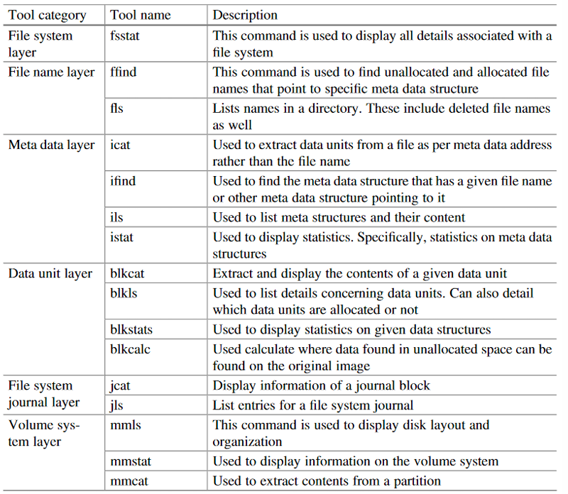
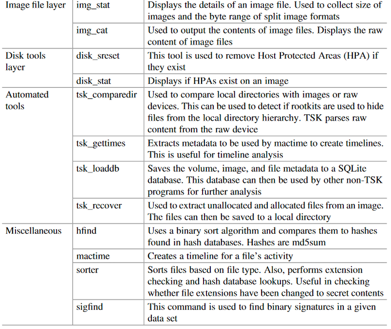
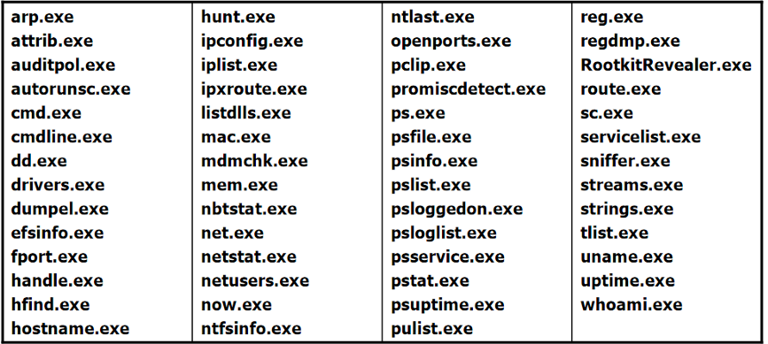

# 2024 Forensics Cheatsheet

## Table of Contents

**1. [General](#1-general)**

**2. [Disk forensics](#2-disk-forensics)**

* [Metadata](#metadata)
* [Disk backup](#disk-backup)
    * [Tools](#tools)
* [File system analysis](#file-system-analysis)
    * [Tools](#tools-1)

**3. [Operating system forensics (Linux)](#3-operating-system-forensics)**

* [Live forensics](#live-forensics)
    * [Tools](#tools-2)
    * [Locations](#locations)
    * [Live-Scripts](#live-scripts)
* [Post- mortem forensics](#post-mortem-forensics)
    * [Locations](#locations-1)

**4. [Operating system forensics (Windows)](#4-operating-system-forensics-windows)**

* [Live forensics](#live-forensics-1)
    * [Tools](#tools-3)
    * [Live-Scripts](#live-scripts-1)
* [Post- mortem forensics](#post-mortem-forensics-1)
    * [Locations](#locations-2)
    * [Tools](#tools-4)
* [Supertimeline](#supertimeline)
* [IR Platforms](#incident-response-platforms-open-source)

**5. [Memory forensics](#5-memory-forensics)**

* [Acquisition](#acquisition)
* [Analysis](#analysis)
    * [unstructered](#unstructured)
    * [structured](#structured)
    * [dump of proccesses at runtime](#dump-of-processes-at-runtime)
    * [IOC's](#iocs)

**6. [Application forensics](#6-application-forensics)**

* [Browser](#browser)
    * [Firefox](#firefox)
    * [Chrome](#chrome)
    * [Edge](#edge)
* [E-mail](#email)
    * [Thunderbird](#thunderbird)
    * [MS Outlook](#ms-outlook)

**7. [Others](#7-others)**

## 1. General

[Eric Zimmermann Tools](https://ericzimmerman.github.io/#!index.md)

[VirusTotal](https://www.virustotal.com/gui/home/upload)

## 2. Disk forensics

### __Metadata:__

MAC-Time: 

`ls -l`

`stat`

Mounting:

`xmount --in <source format> <source location> --out <target format> <target location>`

Check!
` mount -t ntfs-3g -o ro,loop,noexec,show_sys_files,streams_interface=windows,offset=$((51*512)) windowsxp.dd /mnt/windows_mount/ `

`umount <mounted_location>`

### __Disk Backup:__

#### __Tools:__

`dd` `dcfldd` `dc3dd`

Backup: `dd if=/dev/<source> of=<dest>.img bs=65536 conv=noerror,sync`

Remote backup via netcat: `dd if=/dev/<disk0> | nc <ip> <port>`

Hash value: `sha256sum /dev/sdb`

Comparison of hashes:

    1. Create mastercopy & compare hash value: `dd if=/dev/sdb of=mastercopy bs=512`
    `sha256sum mastercopy`

    2. Create workingcopy from mastercopy & compare hash value:
    `dd if=mastercopy of=workingcopy bs=512`
    `sha256sum workingcopy`

Piecewise Hashing (Tools):

    sdhash (binary)
    sdtext (text)

Context  Triggered Piecewise Hashing (Tools):

    ssdeep
        hash1 = ssdeep.hash(<input1>)
        hash2 = ssdeep.hash(<input2>)

        ssdeep.compare(hash1,hash2)

### __File system analysis:__

#### __Tools:__

__The Sleuth Kit (TSK):__

__Overview integrated tools:__




__commonly used ones:__

`mmls -i list`

`mmls -t dos <image-file>`

`dcfldd if=windowsxp.dd bs=512 skip=51 count=256224 of=filesystem.dd`

`sudo mount -o rw filesystem.dd /mnt/windows_mount`

`fsstat <filesystem-image>`

```
fls -r -d <filesystem-image>
    -r recusive
    -d only deleted files
```

```
icat -r <filesystem-image> <file-location e.g. 1476-128-4> > <recovered-file>
    -r recovery mode

        1476 -> NTFS file
        128-4 -> MFT entry attribute
        
```

String search:

    Linux -> strings
    TSK -> srch_strings
        srch_strings -t d <filesystem-image> > keywords.ascii.str

calculate sector adress:  sector address = floor(1588604(Name?)/512(Name?))

`ifind -f <filesystem-type -d <sector adress> <filesystem-image>`

`istat -f <filesystem-type <filesystem-image> <337-128-4(Name?)>`

`ffind <filesystem-image> <337-128-4(Name?)>`

`icat <filesystem-image> <337-128-4(Name?)> > <output-filename>`

Hash-value comparison: `hfind`


__autopsy:__

`sudo autopsy`

__Data Carving:__

```
sudo scalpel
config at: /etc/scalpel/scalpel.conf
``` 


`sudo foremost`

`Testdisk`

`Photorec`

__Data Hiding:__

Bmap (view installation in setup cheatsheet):
```
Usage:
    $ dcfldd if=/dev/urandom of=file.dat bs=1 count=1058    create file with 1058bytes of random data  
    $ ls -l file.dat                                        Whats the size in bytes?
    $ du file.dat                                           How much memory is reserved for file.dat?
    $ sudo su
    $ echo "My secrete message!" | bmap --putslack file.dat put file into slackspace
    $ bmap --slack file.dat                                 read out secret message
```

copy Slackspace out of filesystem-image: `blkls -s <filesystem-image>` or autopsy

__Alternate Data Streams:__

lads.exe <br>streams.exe <br>sfind.exe 

fls/autospsy aswell 

__MFT & Journal-Files:__

filesystem has to be in raw format: `istat -o <51(Name?)> -i raw <filesystem-image>`

| Journal | description |
| ----------- | ----------- |
| $MFT| MasterFileTable|
| $STANDART_INFORMATION <br> $FILENAME| timestamps for files|
| $LOGFILE| saves all ongoing occurrences|
| $I30 <br> $INDX| file & directory names|
| $UsnJrnl | Update Sequence Number |
| $Max (AD of  $Extend\$UsnJrnl)| Information about Change Journal like e.g. the size|
| $J ((AD of  $Extend\$UsnJrnl))| Contents of the journal together with Date, time and reason for the change|

 
https://github.com/jschicht/LogFileParser

extract $Logfile with fls and icat then:

`LogFileParser64.exe <path_to_file>\$LogFile /TimeZone:0.00 /SourceIs32bit:1`

https://github.com/jschicht/ExtractUsnJrnl

show status and size: `fsutil usn queryjournal C:`

Recover deleted files by MFT number from csv file of ExctractUsnJrnl-Tool:

https://github.com/jschicht/NtfsFileExtractor

old UsnJrnl could be in not-allocated memory:

-> Carver https://github.com/PoorBillionaire/

__Timelines:__

```
$ fls -r -f ntfs -m / <filesystem-image> > bodyfile.txt
$ mactime -b bodyfile.txt > timeline.txt
```


## 3. Operating system forensics (Linux)

### __Live forensics:__

#### __Tools:__

| Description | command |
| ----------- | ----------- |
| current local date and time| date -u |
| Main memory content | dd if=/dev/mem |
| Cached ARP Adressen | arp -vn |
| IP Configuration | ip addr show <br>ifconfig -a <br>ip link show <br>ip tunnel show|
| routing table| route –vn <br>route -vnC |
| networkconnections | netstat -an |
| loaded kernelmodules | lsmod |
| open ports  | lsof –nP <br>lsof -i (which programm)|
| open files | lsof <br>lsof +L1 (deleted but open)|
| running processes | ps aux |
| who was logged in? | last |
| who is logged in? | who |
| who is logged in and what is he doing? | w |
| mounted file systems | mount –l, lspci |
| system utilization | top -bn <x> |
| runtime | uptime |
| firewall | iptables-save -c |
| Partitioning scheme | fdisk |
| planned tasks | cat /etc/crontab |
| save /proc directory | tar cvf proc_${PID}.tar /proc/${PID}/{auxv,cgroup,cmdline,comm,environ,limits,maps,sched,schedstat, sessionid,smaps,stack,stat,statm,status,syscall,wchan}|
| save contents of the kernel ring buffer | dmesg|

#### __Locations:__

__log files:__
| |  |
| ----------- | ----------- |
| security logs, application logs|  /var/log/ <br>/var/log/auth.log <br>/var/log/secure <br>/var/log/audit/audit.log <br>/var/log/sudo.log |
| packet manager | /var/log/apt/* <br>/var/lib/dpkg/* <br>/var/log/dnf.rpm.log* <br>--> status files are important |
| syslog| /var/log/messages <br>/var/log/syslog|

```
journalctl --dmesg
journalctl --list-boots
```
__Systemd Journals:__

/var/log/journal/…

    system logs: system@*
    user logs: user-1000@*
        journalctl --file=user-1000@*

__scheduled tasks:__

/var/spool/cron<br>/var/spool/anacron<br>/etc/cron.*/*<br>/etc/cronta

`systemctl status *timer`

<br>

__/proc/* - cat ...__ (dont use local cat)

/proc/version, /proc/sys/kernel/name, /proc/sys/kernel/domainame, 
<br>/proc/cpuinfo, /proc/modules, /proc/swaps, /proc/partitions, /proc/diskstats, 
<br>proc/self/mounts, /proc/uptime

Real-timeclock: /proc/driver/rtc 

Main memory: /proc/kcore

<br>

__/var/lib/*__
| |  |
| ----------- | ----------- |
|  | /var/lib/NetworkManager/* |
|  | /var/lib/bluetooth/*  |
|  | /var/lib/upower/* |
| Crash-Dump | /var/lib/systemd/coredump |

`man core`

convert timestamp from epoch time `date -d @1655199269`

#### __Live-Scripts:__

[LinuxLiveResponse](https://github.com/puffyCid/linuxLiveResponse)

### __Post-mortem forensics:__

#### __Locations:__

| Description | possible locations |
| ----------- | ----------- |
| Systemconfiguration | /etc/passwd <br>/etc/shadow <br>/etc/group <br>/etc/network/interfaces <br>/etc/inetd.conf  <br>services <br>/etc/rc.d or /etc/init.d or /etc/rc.local |
| Linux standards base |  /etc/lsb-release or /etc/os-release |
| Kernel version |  file /boot/vmlinuz  |
| Kernel config/parameters | grub.cfg and /etc/sysctl.*|
| Kernel Modules | /etc/modprobe* <br>/etc/modules <br>/etc/modules-load* |
| Systemd networkconfiguration | /usr/lib/systemd/network <br>/lib/systemd/network (default) <br>/etc/systemd/network <br>/etc/network/interfaces  |
| strange MAC-times | /sbin/ <br>/usr/sbin |
| Bash-history | ~/.bash_history |
| Autostart GUI-applications | ~/.config/autostart/* |
| recently opened files | ~/.recently-used <br>~/.local/share/recently-used.xbel |
| Thumbnails | ~/.cache/thumbnails |
| overwritten MIME-types | ~/.config/mimeapps.list |
| trash | ~/.local/share/Trash <br>~/.Trash |
| user-specific data/configurations | /home/$USER <br>%USERPROFILE%|
| temporary files | /tmp <br>/var/tmp |
| swap partion | /etc/fstab |

## 4. Operating system forensics (Windows)

### __Live forensics:__

#### __Tools:__
`robocopy`

`doskey /history`

`tasklist /svc`



[Windows Sysinternals](https://docs.microsoft.com/de-de/sysinternals/downloads/sysinternals-suite)
    
https://live.sysinternals.com/

most common ones:
- Process Explorer
- Autoruns
- Process Hacker
    - irsetup.exe
    - WinCtrProc.exe
    - WinCtrCon.exe
- [psloggedon.exe](https://docs.microsoft.com/dede/sysinternals/downloads/psloggedon)
- psfile.exe
- [logonsessions.exe](https://docs.microsoft.com/dede/sysinternals/downloads/logonsessions)
- [pslist.exe](https://docs.microsoft.com/de-de/sysinternals/downloads/pslist)
- [listdlls.exe](https://docs.microsoft.com/de-de/sysinternals/downloads/listdlls)
- [handle.exe](http://technet.microsoft.com/en-us/sysinternals/bb896655.aspx)
- Pclip.exe
- Ressource Monitor & netstat

[PowerForensics - PowerShell Digital Forensics](https://powerforensics.readthedocs.io/en/latest/)

#### __Live-Scripts:__
[Invoke-LiveRespones](https://mgreen27.github.io/posts/2018/01/14/Invoke-LiveResponse.html)
[Live-Forensicator](https://github.com/Johnng007/Live-Forensicator)
[Huntress](https://github.com/zaneGittins/Huntress)

### __Post-mortem forensics:__

#### __Locations:__

__Registry:__

| Registry hive | description | Path to hive-file | environment variable | Supporting file
| ----------- | ----------- | ----------- | ----------- | ----------- | 
| HKEY_LOCAL_MACHINE\SAM | | C:\Windows\system32\ <br>config\SAM |  | Sam, Sam.log, Sam.sav | 
| HKEY_LOCAL_MACHINE\SECURITY | | C:\Windows\system32\ <br>config\SECURITY| | Security, Security.log, Security.sav | 
| HKEY_LOCAL_MACHINE\SOFTWARE | | C:\Windows\system32\ <br>config\SOFTWARE| | Software, Software.log, Software.sav | 
| HKEY_LOCAL_MACHINE\SYSTEM |  | C:\Windows\system32\ <br>config\SYSTEM| | System, System.alt, System.log, System.sav | 
| HKEY_CURRENT_CONFIG |  || | System, System.alt, System.log, System.sav, Ntuser.dat, Ntuser.dat.log| 
| HKEY_USERS\DEFAULT | | C:\Windows\system32\ <br>config\default | | Default, Default.log Default.sav |
| | system-/computer-wide configuration | | %SystemRoot%\ <br>System32\config | |
| | user-specific configuration | | %USERPROFILE%\ <br>NTUSER.dat | |
| HKEY_USERS |  |  C:\Documents and Setting\ <br>User Profile\NTUSER.DAT| | | 
| HKEY_LOCAL_MACHINE\Software\ <br>Microsoft\Windows\CurrentVersion\ <br>Run | Autorun from programms | | | | 
| HKEY_LOCAL_MACHINE\Software\ <br>Microsoft\Windows\CurrentVersion\ <br>RunOnce | Autorun from programms | | | | 
| HKEY_LOCAL_MACHINE\System\ <br>ControlSet00x\Enum\USBSTOR | connected USB-devices | | | | 
| HKEY_LOCAL_MACHINE\SOFTWARE\ <br>Microsoft\Windows NT\CurrentVersion\ <br>NetworkList\Profiles | connected WLAN | | | | 
| HKEY_CURRENT_USER\Software\ <br>Microsoft\Windows\CurrentVersion\ <br>Explorer\RecentDocs | currently opened documents | | | |
| HKEY_CURRENT_USER\software\ <br>microsoft\windows\currentversion\ <br>Explorer\RunMRU | userlist | | | |
| HKEY_CURRENT_USER\Software\ <br>Microsoft\Windows\Current Version\ <br>Explorer| MRU (Most Recently Used) | | | |
| | Shell Bags | C:\Users\BENUTZER\ <br>AppData\Local\ <br>Microsoft\Windows\ <br>USRCLASS.dat | | |
| HKCU\Software\Microsoft\ <br>Windows\CurrentVersion\ <br>Explorer\UserAssist | User Assist | | | |
| | Amcache.hve / RecentFileCache.bcf | | \%SystemRoot%\ <br>AppCompat\Programs\ <br>Amcache.hve | |
| SYSTEM\CurrentControlSet\ <br>Control\SessionManager\ <br>AppCompatCache | Registry: Shimcache (until Win10) <br>Path: Win11 Programm Compatibility Assistant (PCA) | | C:\Windows\ <br>appcompat\pca | |
| | Windows 10 Timeline |  C:\Users\<user>\ <br>AppData\Local\ <br>Connected <br>DevicesPlatform\L."user"\ <br>ActivitiesCache.db | | |

#### __Tools:__

__RegRipper__ (sometimes wrong outputs -> not used in entreprises commonly):

```
rip.pl -r <HIVE> -p <plugin>
```
[Plugin - HIVE Pair database](https://hexacorn.com/tools/3r.html)

[Plugin Database](https://github.com/keydet89/RegRipper3.0)

regtime plugin to create timeline etc.

```
reg.exe QUERY "HIVE-PATH" /s

example(getting VNC password): reg.exee QUERY "HKEY_LOCAL_MACHINE\Software\ORL\WinVNC3" \s
```
[Registry Explorer by Eric Zimmermann](https://www.sans.org/tools/registry-explorer/)

[Windows Registry Recovery - Donwload(Download starting)](https://www.mitec.cz/Downloads/WRR.zip)


### __Supertimeline:__

[Plaso](https://plaso.readthedocs.io/en/latest/)

[Log2timeline - Timeline Color Template](https://github.com/riodw/Log2timeline-TIMELINE_COLOR_TEMPLATE)

### __Incident Response Platforms (open source?)__

CYBER TRIAGE

Velociraptor

GRR Rapid Response

## 5. Memory forensics

### __Acquisition:__

#### __Windows:__

| Location | description |
| ----------- | ----------- |
| \\.\PhysicalMemory | Device Object in Windows 2000-VISTA, RAW data |
| \\.\DebugMemory | Device Object in Windows 2000-VISTA, RAW data | 
-> no longer accessible from user mode

| Location(file) | description | analysis |
| ----------- | ----------- | ----------- |
| C:\hiberfil.sys |  in active mode saves part of the RAM <br> Power-On overwrites content with zeros <br> gets encrypted by Bitlocker not by TrueCrypt| save with RawCopy.exe, FTKImager <br> analyze with Hibr2Bin, Volatility, Rekall, PTFinder, FATKit, MemParser, PMODump, SandMan|
| C:\pagefile.sys | pagefile of virual memory <br> outsources data during runtime| use strings or YARA-Rules |
| C:\swapfile.sys | only Windowsn 8/10 <br> fixed size of 256 MB <br> pagefile for modern apps (saves entire working set)|  |

``` 
powercfg /h[hibernate] [on|off]
psshutdown –h
 ```

Tools:
- FTK Imager
- Belkasoft Live RAM Capturer
- OSForensics
- Sysinternals LiveKd.exe
- [WinPmem](https://github.com/Velocidex/WinPmem)

#### __Linux:__

| Location | description |
| ----------- | ----------- |
| /dev/mem | RAW data, System Memory|
| /dev/fmem| fmem Kernel modules|
| /dev/kmem | Kernel Memory|
| /proc/kcore $INDX| some file systems|

| Location | type |
| ----------- | ----------- | 
| /proc/swaps | swap-file |
| /etc/fstab | swap-partition | 

`swapon -s`

Tools:
- LiME – Linux Memory Extractor


### __Analysis:__

#### __unstructured:__

Tools:
- strings
- grep
- less
- Regular expressions
- Data Carving:
    - scalpel
    - foremost
    - [Digital Corpora Bulk Extractor](https://corp.digitalcorpora.org/downloads/bulk_extractor/)
        - [User Manual Guide](https://digitalcorpora.s3.amazonaws.com/downloads/bulk_extractor/BEUsersManual.pdf)
- use [IOC's](#iocs)

#### __structured:__

Tools:
- Volatility:
    - [Command References](https://github.com/volatilityfoundation/volatility/wiki/Command-Reference)
    - [Volatitily Community](https://github.com/volatilityfoundation/community)
    - since version 3.0 no longer --profile needed
- Rekall
- Redline
- [MemProcFS](https://github.com/ufrisk/MemProcFS)
    - makes you view the RAM in virtual filesystem

#### __dump of processes at runtime?:__

- dump processes from Process Explorer/Process Hacker

#### __IOC's:__

types of IOC - Rules:
- YARA (memory)
    - [YARA rule collection](https://github.com/Yara-Rules/rules)
    - [YARA - Readthedocs](https://yara.readthedocs.io/en/v3.6.3/writingrules.html)
- Snort (network)
- OpenIOC
- STIX
- MISP

[IOC-Collection](https://github.com/sroberts/awesome-iocs)

Tools TO-DO:
- Loki

## 6. Application forensics

### __Browser:__

use DB Browser SQlite to view databases

#### __Firefox:__

| file | description |
| ----------- | ----------- | 
| places.sqlite | Browser history, download history, bookmarks |
| cookies.sqlite | Cookies | 
| formhistory.sqlite | Search in the search bar or in web forms |
| key4.db, logins.json| passwords |

[Dumpzilla](https://www.dumpzilla.org/)
- python3 script used to extract artifacts from Firefox, Iceweasel, Seamonkey

#### __Chrome:__
`chrome://version`

- files without file extension

| type | path | 
| ----------- | ----------- | 
| Configuration | \Users\<UserName>\AppData\Local\Google\Chrome\User Data\Default |
| Configuration | \Users\<UserName>\AppData\Local\Google\Chrome\User Data\Profile x |
| History |  |
| Bookmarks | \Users\<UserName>\AppData\Local\Google\Chrome\User Data\Default\Bookmarks |
| Cookies | till version 95:  \Users\<UserName>\AppData\Local\Google\Chrome\User_Data\Default\Cookies <br> from version 96:  \Users\<UserName>\AppData\Local\Google\Chrome\User_Data\Default\Network\Cookies|
| Cache | \Users\<UserName>\AppData\Local\Google\Chrome\User_Data\Default\Cache\Cache_Data |
| Passwords | \Users\<UserName>\AppData\Local\Google\Chrome\User_Data\Default\Login_Data  |
| History |  |  |

#### __Edge:__
ESE Datenbank spartan.edb -> view with Nirsoft ESEDatabaseView

\Users\<UserName>\AppData\Local\Packages\Microsoft.MicrosoftEdge_xxxx\AC\MicrosoftEdge
\User\Default\DataStore\Data\nouser1\xxxx-xxx\DBStore\spartan.edb

#### __further Tools:__
- Nirsoft WebCacheImageInfo
- Nirsoft ImageCacheViewer
- Nirsoft BrowserAddonsView
- Nirsoft MyLastSearch
- Nirsoft WebBrowserPassview
- Web Historian
- [Belkasoft Browser Analyzer](https://belkasoft.com/get)
- [Hindsight](https://github.com/obsidianforensics/hindsight)

### __Email:__

#### __General:__

#### __Thunderbird:__

#### __MS Outlook:__

## 7. Others